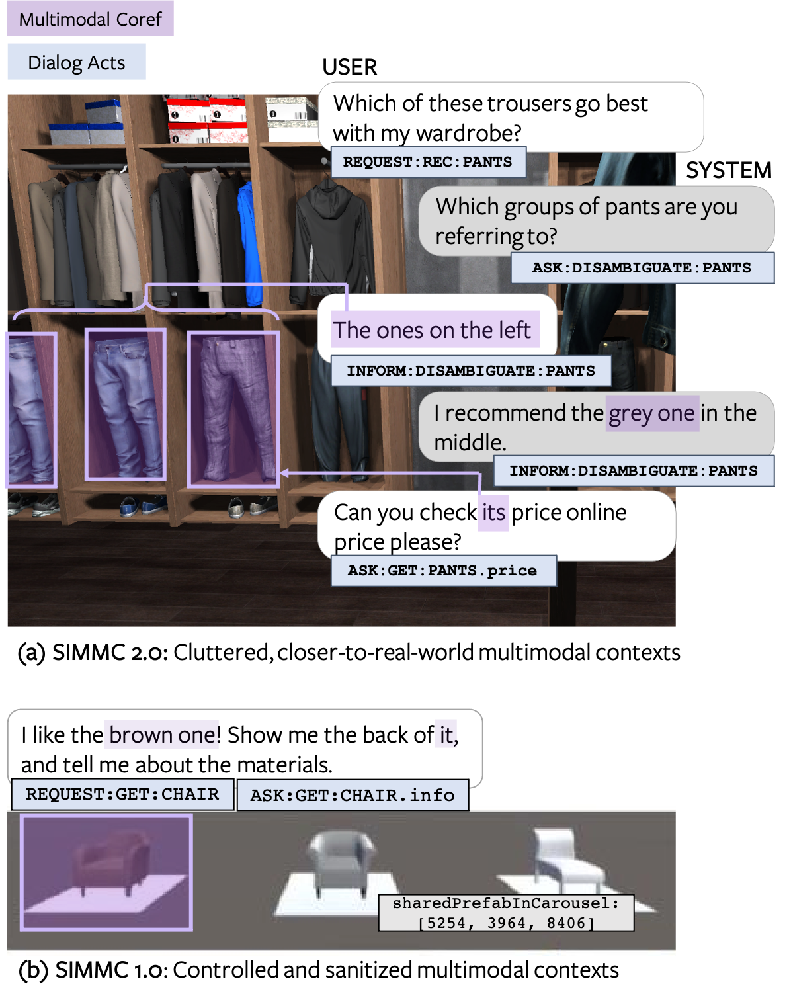

# DSTC10 SIMMC 2.0 Multimodal Task Oriented Dialogue System Challenge

This repository contains the submission and experimentation code for DSTC10 SIMMC 2.0 track by [KAIST AIPR Lab](http://ailab.kaist.ac.kr/). Most of the code base is largely derived from the track [repository][simmc2] for [DSTC10][dstc10]. The SIMMC challenge aims to lay the foundations for the real-world assistant agents that can handle multimodal inputs, and perform multimodal actions. Similar to the [SIMMC 1.0][simmc1] (as part of DSTC9), we focus on the task-oriented dialogs that encompass a situated multimodal user context in the form of a co-observed & immersive virtual reality (VR) environment.
The conversational context is dynamically updated on each turn based on the user actions (e.g. via verbal interactions, navigation within the scene).
For this challenge, we release a new Immersive SIMMC 2.0 dataset in the shopping domains: furniture and fashion.   

**Track Organizers**: Seungwhan Moon, Satwik Kottur, Paul A. Crook, Ahmad Beirami, Babak Damavandi, Alborz Geramifard

**Repository Collaborators**: Haeju Lee, Youngjune Lee, Oh Joon Kwon

<figure>
 
<figcaption><i>Example from SIMMC-Furniture Dataset</i></figcaption> 
</figure>

## Important Links

* [Task Description Paper][simmc2_arxiv]
* [Submission Instructions](SUBMISSION_INSTRUCTIONS.md)


## Timeline

| **Date** | **Milestone** |
| :--: | :-- |
| June 14, 2021 | Training & development data released |
| Sept 24, 2021  | Test-Std data released, End of Challenge Phase 1 |
| Oct 1, 2021 | Entry submission deadline, End of Challenge Phase 2 |
| Oct 8, 2021 | Final results announced |


## Track Description

### Tasks and Metrics

We present four sub-tasks primarily aimed at replicating human-assistant actions in order to enable rich and interactive shopping scenarios.

| Sub-Task #1 | [Multimodal Disambiguation](mm_disambiguation) |
|---------|---------------------------------------------------------------------------------------------------------------------------------------|
| Goal | To classify if the assistant should disambiguate in the next turn |
| Input | Current user utterance, Dialog context, Multimodal context |
| Output |  Binary label |
| Metrics |  Binary classification accuracy |

| Sub-Task #2 | [Multimodal Coreference Resolution](mm_coref) |
|---------|---------------------------------------------------------------------------------------------------------------------------------------|
| Goal | To resolve referent objects to thier canonical ID(s) as defined by the catalog. |
| Input | Current user utterance with objection mentions, Dialog context, Multimodal context |
| Output |  Canonical object IDs |
| Metrics |  Coref F1 / Precision / Recall |

| Sub-Task #3 | [Multimodal Dialog State Tracking (MM-DST)](mm_dst) |
|---------|---------------------------------------------------------------------------------------------------------------------------------------|
| Goal | To track user belief states across multiple turns |
| Input | Current user utterance, Dialogue context, Multimodal context |
| Output | Belief state for current user utterance |
| Metrics | Slot F1, Intent F1 |

| Sub-Task #4 | [Multimodal Dialog Response Generation & Retrieval](mm_response_generation)  |
|---------|---------------------------------------------------------------------------------------------------------------------------------------|
| Goal | To generate Assistant responses or retrieve from a candidate pool  |
| Input | Current user utterance, Dialog context, Multimodal context, (Ground-truth API Calls) |
| Output | Assistant response utterance |
| Metrics | Generation: BLEU-4, Retrieval: MRR, R@1, R@5, R@10, Mean Rank |

### Evaluation

For the DSTC10 SIMMC Track, we will do a two phase evaluation as follows. 

**Challenge Period 1**:
Participants will evaluate the model performance on the provided `devtest` set.
At the end of Challenge Period 1 (Sept 24), we ask participants to submit their model prediction results and a link to their code repository.

**Challenge Period 2**:
A `test-std` set will be released on Sept 28 for the participants who submitted the results for the Challenge Period 1.
We ask participants to submit their model predictions on the `test-std` set by Oct 1. 
We will announce the final results and the winners on Oct 8.


## Repository-specific Instructions

### Download the dataset
* In order to circumvent the Git-LFS limit imposed by Github, we provide a separate download script in `download.sh`. Simply run the script to download and organize the dataset.

### Running training / evaluation
* For now, most of the experiments are run by the subtask scripts under `model` directory. The code will be refactored under `tasks` once done with experimentations.
### Reporting Results for Challenge Phase 1
* Submit your model prediction results on the `devtest` set, following the [submission instructions](./SUBMISSION_INSTRUCTIONS.md). 
* We will release the `test-std` set (with ground-truth labels hidden) on Sept 24.

### Reporting Results for Challenge Phase 2
* Submit your model prediction results on the `test-std` set, following the [submission instructions](./SUBMISSION_INSTRUCTIONS.md). 
* We will evaluate the participants’ model predictions using the same evaluation script for Phase 1, and announce the results.

## Citations

Please cite the following articles for using the SIMMC 2.0 dataset and baseline:
```
@article{kottur2021simmc,
  title={SIMMC 2.0: A Task-oriented Dialog Dataset for Immersive Multimodal Conversations},
  author={Kottur, Satwik and Moon, Seungwhan and Geramifard, Alborz and Damavandi, Babak},
  journal={arXiv preprint arXiv:2104.08667},
  year={2021}
}
```
**NOTE**: The [paper][simmc2_arxiv] above describes in detail the datasets, the collection process, and some of the baselines we provide in this challenge. The paper reports the results from an earlier version of the dataset and with different train-dev-test splits, hence the baseline performances on the challenge resources will be slightly different. 

## License

SIMMC 2.0 is released under [CC-BY-NC-SA-4.0](https://creativecommons.org/licenses/by-nc-sa/4.0/legalcode), see [LICENSE](LICENSE) for details.


[dstc10]:https://sites.google.com/dstc.community/dstc10/home
[simmc1]:https://github.com/facebookresearch/simmc
[simmc2]:https://github.com/facebookresearch/simmc2
[simmc2_arxiv]:https://arxiv.org/pdf/2104.08667.pdf
[simmc_arxiv]:https://arxiv.org/abs/2006.01460
